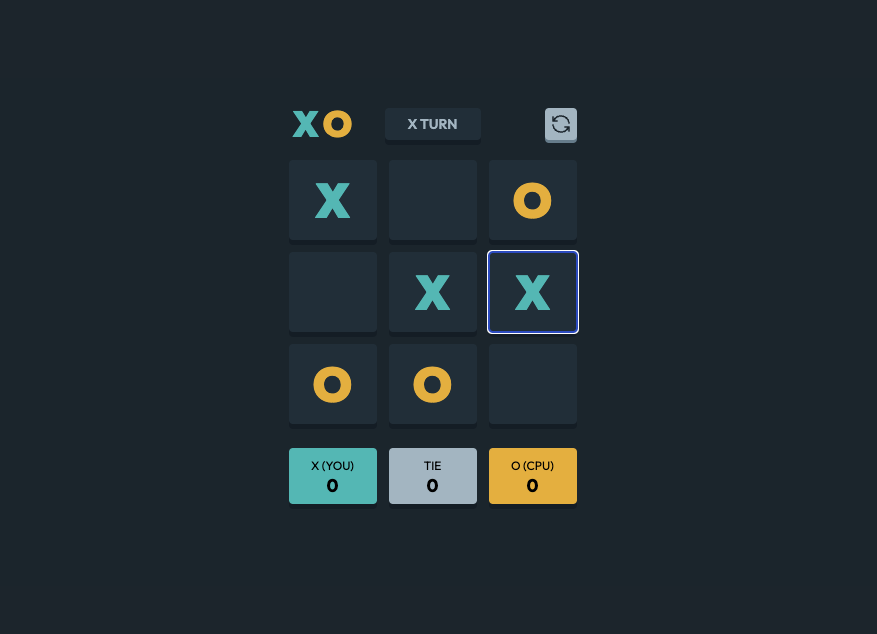

# Tic-Tac-Toe Game

## Table of contents

- [Overview](#overview)
  - [About](#about)
  - [Screenshot](#screenshot)
  - [Links](#links)
- [My process](#my-process)
  - [Built with](#built-with)
- [Author](#author)

## Overview

### About

Users should be able to:

- View the optimal layout for the game depending on their device's screen size
- See hover states for all interactive elements on the page
- Play the game either solo vs the computer or multiplayer against another person

### Screenshot

### Links

- Live Site URL: [Link](https://tic-tac-toe-eta-two.vercel.app/)

## My process

Created with Nextjs using various components to store state of game

### Built with

- [React](https://reactjs.org/) - JS library
- [Next.js](https://nextjs.org/) - React framework
- [TailwindCSS](https://tailwindcss.com/) - For styles

## Author

- Website - [Charles Leighton](https://www.chleighton.live/)
- Frontend Mentor - [@chleighton1](https://www.frontendmentor.io/profile/chleighton1)
